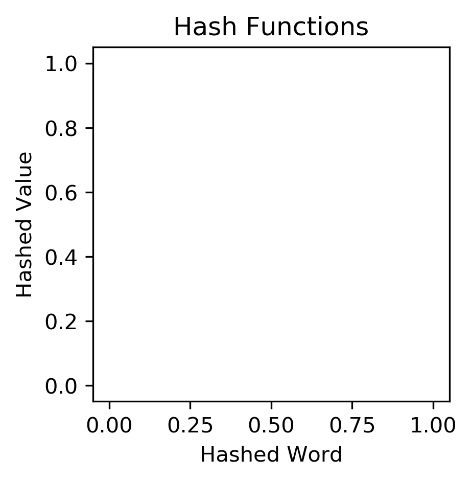

Hash Tables

This assignment uses various functions and classes to search and fill hash tables.

hash_functions.py contains functions for assigning a value to an input hash key.

hash_tables.py contains classes and functions for searching and filling a hash table.

I do not know how to interpret the results of this assignment. The code in hash_functions.py and hash_tables.py seems to run fine. However, I don't know if the hash tables created are correct. The plots below are made with the following commands:

python hash_functions.py --input 'hash.txt' --size 1000 --method 'ascii' | python scatter.py --out_file ascii_hash.png

python hash_functions.py --input 'hash.txt' --size 1000 --method 'rolling' | python scatter.py --out_file ascii_hash.png

Clearly something went wrong when analyzing the results of the hash tables.

I did not have time to write unit tests for hash_functions.py, hash_tables.py or scatter.py.